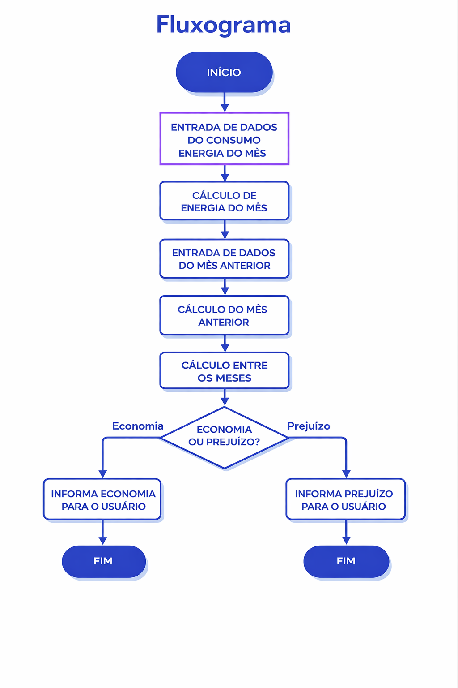

# 🚀 consumo e ecônomia de energia

> Um projeto academico para aprofundamento em python

---

## 📋 Índice
* [Sobre](#-sobre)
* [Funcionalidades](#-funcionalidades)
* [Tecnologias](#-tecnologias)
* [Como Rodar](#-como-rodar)
* [Estrutura de Pastas](#-estrutura-de-pastas)
* [Licença](#-licença)

---

## 💻 Sobre
Esse projeto tem como finalidade calcular o valor total de 
energia de uma residencia e informar uma economia ou prejuizo.

## ✨ Fluxograma


## 🛠 Tecnologias
As principais ferramentas usadas no projeto:
* **Linguagem:** [Python / JavaScript / etc]
* **Frameworks/Bibliotecas:** [Pandas, Flask, React]
* **Banco de Dados:** [SQLite, PostgreSQL]
* **Outros:** [Docker, Git LFS]

## 🚀 Como Rodar
Siga os passos abaixo para ter uma cópia do projeto rodando na sua 
máquina:

### Pré-requisitos
* [Ex: Python 3.10 ou superior instalado]
* [Ex: Git instalado]

### Instalação
1. Clone o repositório:
   ```bash
   git clone [https://github.com/usuario/projeto.git](https://github.com/usuario/projeto.git)